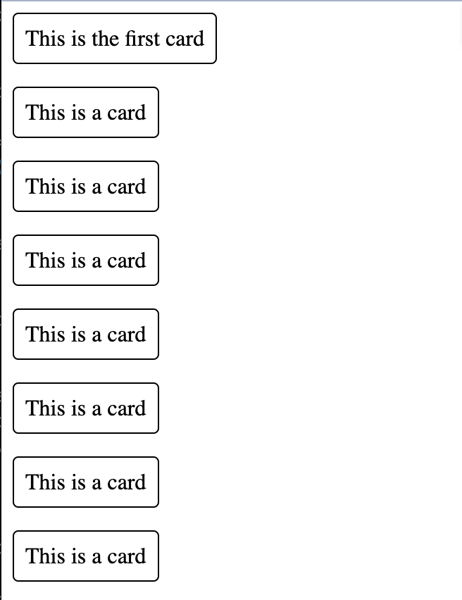
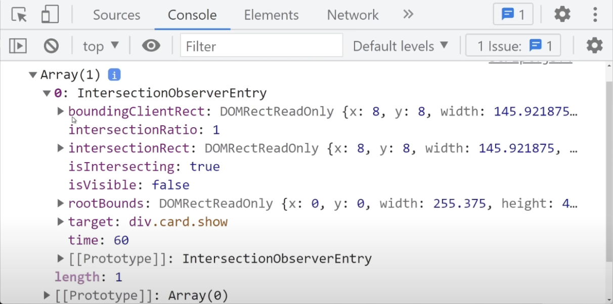

# Intersection Observer 
- [Video: Learn Intersection Observer In 15 Minutes](https://www.youtube.com/watch?v=2IbRtjez6ag)
- [Blog: JavaScript Intersection Observer Ultimate Guide](https://blog.webdevsimplified.com/2022-01/intersection-observer/)
- [Docs: Intersection Observer API](https://developer.mozilla.org/en-US/docs/Web/API/Intersection_Observer_API)
- [GitHub URL](https://github.com/edpau/learning_intersection-observer-api)
- [Live Site URL](https://edpau.github.io/learning_intersection-observer-api/)



## Summary 
This video show us
1. How to add animation to card that enter and leave the screen (root)
2. infinite scroll, add new card with lazy loading when we scroll to the bottom, infinitely add new card when we about to see the last card 

## Use case 
- scroll animations
- lazy loading images 
- infinite scroll

## Keywords
- `intersectionRatio: 1` what percentage of the object is on the screen, 1 mean 100% of it is on the screen
- `isIntersecting: true` is it on the screen, is it visible to the user?
- `boundingClientRect` the shape of the target element
- `intersectionRect` the amount of the space that is visible on the screen of the target element
- `rootBounds` the bounds of our screen, by default our root is our screen
- `target` the target element

```js
const cards = document.querySelectorAll(".card")

const observer = new IntersectionObserver(entries => {
    console.log(entries)
})

observer.observe(cards[0])
```

how we can console log the element, above code print out the first card



## How we add animation to card that enter and leave the screen (root)
- In the observer, we add the show class if the card is intersecting (on-screen) and remove the show class when the card is not intersecting (not on-screen), so there will be animation play when the top card leave the screen, and the bottom card appear on the screen. 
- `entry.target.classList.toggle("show", entry.isIntersecting)` when entry.isIntersecting is true, the show class is added, when it is false, the show class is removed.

```js
const cards = document.querySelectorAll(".card");

const observer = new IntersectionObserver(
  (entries) => {
    entries.forEach((entry) => {
      entry.target.classList.toggle("show", entry.isIntersecting);
    });
  },
  {
    threshold: 0.5,
    // rootMargin: "-100px"
  }
);

cards.forEach((card) => {
  observer.observe(card);
});
```

### option
- `threshold` by default, entry.isIntersecting is true even 1px of the element is on-screen, we can control it with threshold option. It takes 0 - 1, by default it is 0%, so the class is added even 1px of the element is on-screen. It make the animation hard to see. In our example we make it to 0.5, so the card will appear and disappear when it is 50% in the screen. 
- `rootMargin` offset our root container, by default it is 0, we can set it to `rootMargin: -100px`, the container is 100px smaller than it is from the top of the container and from the bottom of the container. It is useful in lazy loading, load before it is appear to the screen. 
- `root` define the actual container you care about. In our example, it is the body as a container. We can make the parent container scrolling and nested in our page, it will work the same. 

### extra thing we can do
- as soon as the element is on-screen, we can stop observe it ` if (entry.isIntersecting) observer.unobserve(entry.target);`, it is useful for lazing loading image, execute code to download the image when it is about to appear then stop observe it. 

## lazy loading, create new card when the scroll to the last card

- we create an observer only look at the last card, to start we use `document.querySelector(".card:last-child")` to select the last card. 
- the observer only execute when the last card is on the screen. 
- when the last card is on the screen, we create new card with `function loadNewCards()`
- we then stop observe the previous last card on screen and update the observer to observe the new last card
- we use the option `rootMargin: "100px"` to make the lazy loading start earlier than the last card actually appear on the screen, as fetching from api may take longer. `rootMargin: "100px"` mean that the top and bottom of the container is 100px bigger than the actual size, so it load earlier than the last card actually appear on the screen.

```js 
// lazy loading, create new card when the scroll to the last card
// start with observe the last card
const lastCardObserver = new IntersectionObserver((entries) => {
  const lastCard = entries[0];
  // do nothing when it is not on-screen
  if (!lastCard.isIntersecting) return;
  // below code only run if the last card is starting to be visible
  loadNewCards();
  // when new card is here, last card is no longer the last card, we don't observe it
  lastCardObserver.unobserve(lastCard.target);
  // we observe the new last card instead
  lastCardObserver.observe(document.querySelector(".card:last-child"));
}, {
    // the lazy loading start earlier than the last card actually appear, as fetching from api may take longer
    rootMargin: "100px"
});

lastCardObserver.observe(document.querySelector(".card:last-child"));

const cardContainer = document.querySelector(".card-container");
function loadNewCards() {
  for (let i = 0; i < 10; i++) {
    const card = document.createElement("div");
    card.textContent = "New Card";
    card.classList.add("card");
    observer.observe(card);
    cardContainer.append(card);
  }
}
```

## How Intersection Observer works under the hood

Why we pass `entries` to the IntersectionObserver call back function, `const observer = new IntersectionObserver((entries){...}` , but only pass single element to the observer. `observer.observe(card);`

### How the Observing Process Works
1. **Calling `observe`**:
   When you call `observer.observe(card)`, you're telling the `IntersectionObserver` to watch that specific `card` element. This happens for each card in your loop:
   ```javascript
   cards.forEach(card => {
       observer.observe(card);
   });
   ```
   After this loop, all `.card` elements are being observed by the same `observer`.

2. **Triggering the Callback**:
   The callback you define (`entries => { ... }`) is not called immediately after observing each card. Instead, it is called whenever one or more of the observed elements change their intersection state with the root (e.g., scrolls into view or out of view).

3. **Why `entries` is an Array**:
   The `entries` array contains one object per observed element that had a change in intersection state **during that observation cycle**. Even though you observe cards individually, the browser batches changes to optimize performance. 
   
   For example:
   - If two cards become visible at the same time during a scroll, the `entries` array will contain two entries.
   - If only one card changes intersection state, the `entries` array will have just one entry.

4. **Each `entry` in `entries`**:
   Each entry in the `entries` array corresponds to an observed element and includes properties like:
   - `entry.target` (the element itself, e.g., `.card`)
   - `entry.isIntersecting` (whether the element is in view)
   - `entry.intersectionRatio` (the percentage of the element in view)

### Why It's Not a Single Element
Even if only one card changes state at a time, the `IntersectionObserver` callback **always passes an array** (`entries`). This design accommodates scenarios where multiple elements are observed and can change state together.

### Example of Multiple Entries
Imagine scrolling through your cards. If three cards become visible at the same time, the callback receives something like this in `entries`:

```javascript
[
    { target: <div class="card">Card 1</div>, isIntersecting: true, ... },
    { target: <div class="card">Card 2</div>, isIntersecting: true, ... },
    { target: <div class="card">Card 3</div>, isIntersecting: true, ... }
]
```

### What Happens When Observing a Single Card?
If only one card changes intersection state at a time (e.g., a slow scroll), the `entries` array will contain just one entry:

```javascript
[
    { target: <div class="card">Card 1</div>, isIntersecting: true, ... }
]
```

Even though the array contains only one entry, it is still an array because the API is designed to handle multiple changes in one go.

### Summary
- `entries` is always an array, even if it contains only one element, to support batching.
- The `observe` method registers each card with the same `IntersectionObserver`.
- The callback gets triggered for all observed elements whose intersection state changes in the same observation cycle. This is why you loop through `entries`.